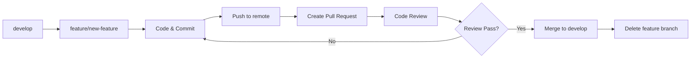

# 🌳 CHIẾN LƯỢC QUẢN LÝ NHÁNH GIT

## 📋 MỤC LỤC
1. [Tổng quan](#tổng-quan)
2. [Cấu trúc nhánh](#cấu-trúc-nhánh)
3. [Quy trình làm việc](#quy-trình-làm-việc)
4. [Naming Convention](#naming-convention)
5. [Commit Message](#commit-message)
6. [Pull Request](#pull-request)
7. [Code Review](#code-review)
8. [Phân công theo Week](#phân-công-theo-week)

---

## 🎯 TỔNG QUAN

Dự án **Library Management System** sử dụng **Git Flow** được đơn giản hóa phù hợp với team 3 developers trong 3 tháng.

### Nguyên tắc cơ bản:
- ✅ **Không bao giờ** commit trực tiếp vào `main`
- ✅ **Luôn tạo** Pull Request để merge code
- ✅ **Review code** trước khi merge
- ✅ **Test kỹ** trước khi merge vào `develop`
- ✅ **Commit thường xuyên** với message rõ ràng

---

## 🌿 CẤU TRÚC NHÁNH

### 1. **Nhánh chính (Permanent Branches)**

```
main
├── develop
└── staging (optional)
```

#### **`main`** - Production Branch
- **Mục đích**: Code production, luôn stable
- **Merge từ**: `staging` hoặc `develop` (sau khi test kỹ)
- **Deploy**: Auto-deploy to production
- **Bảo vệ**: Yêu cầu PR + Review + CI pass
- **Update**: Chỉ merge vào cuối mỗi sprint hoặc hotfix

```bash
# Chỉ được merge qua Pull Request
# KHÔNG BAO GIỜ commit trực tiếp
```

#### **`develop`** - Integration Branch
- **Mục đích**: Tích hợp tất cả features đang phát triển
- **Merge từ**: Tất cả `feature/*` branches
- **Deploy**: Auto-deploy to development server
- **Update**: Hàng ngày khi có feature hoàn thành

```bash
# Tạo develop branch
git checkout main
git checkout -b develop
git push -u origin develop
```

#### **`staging`** - Pre-production Branch (Optional)
- **Mục đích**: Test giống production environment
- **Merge từ**: `develop`
- **Update**: Cuối mỗi tuần hoặc trước release

---

### 2. **Nhánh tạm thời (Temporary Branches)**

#### **Feature Branches** - `feature/*`
Phát triển tính năng mới

```bash
# Format
feature/<tên-tính-năng>
feature/<module>-<tính-năng>

# Ví dụ
feature/authentication
feature/book-qr-code
feature/borrowing-system
feature/admin-dashboard
```

**Quy trình:**
```bash
# 1. Tạo từ develop
git checkout develop
git pull origin develop
git checkout -b feature/authentication

# 2. Code và commit
git add .
git commit -m "feat(auth): implement JWT authentication"

# 3. Push lên remote
git push -u origin feature/authentication

# 4. Tạo Pull Request trên GitHub
# feature/authentication → develop

# 5. Sau khi merge, xóa branch
git checkout develop
git branch -d feature/authentication
git push origin --delete feature/authentication
```

---

#### **Bugfix Branches** - `bugfix/*`
Sửa lỗi không khẩn cấp

```bash
# Format
bugfix/<mô-tả-ngắn>

# Ví dụ
bugfix/fix-login-error
bugfix/correct-fine-calculation
bugfix/qr-scanner-not-working
```

**Quy trình:**
```bash
# 1. Tạo từ develop
git checkout develop
git checkout -b bugfix/fix-login-error

# 2. Fix bug và commit
git add .
git commit -m "fix(auth): resolve login redirect issue"

# 3. Push và PR
git push -u origin bugfix/fix-login-error
# Create PR: bugfix/fix-login-error → develop
```

---

#### **Hotfix Branches** - `hotfix/*`
Sửa lỗi khẩn cấp trên production

```bash
# Format
hotfix/<mô-tả-lỗi>

# Ví dụ
hotfix/security-vulnerability
hotfix/database-connection-error
hotfix/critical-bug
```

**Quy trình:**
```bash
# 1. Tạo từ main (QUAN TRỌNG!)
git checkout main
git pull origin main
git checkout -b hotfix/security-vulnerability

# 2. Fix và commit
git add .
git commit -m "fix: patch security vulnerability CVE-2024-XXX"

# 3. Merge vào BOTH main VÀ develop
git checkout main
git merge hotfix/security-vulnerability
git push origin main

git checkout develop
git merge hotfix/security-vulnerability
git push origin develop

# 4. Xóa hotfix branch
git branch -d hotfix/security-vulnerability
```

---

#### **Release Branches** - `release/*`
Chuẩn bị cho release mới

```bash
# Format
release/v<version>

# Ví dụ
release/v1.0.0
release/v1.1.0
```

**Quy trình:**
```bash
# 1. Tạo từ develop (cuối tháng 3)
git checkout develop
git checkout -b release/v1.0.0

# 2. Version bump, fix bugs nhỏ
# Update version trong package.json, requirements.txt
git commit -m "chore: bump version to 1.0.0"

# 3. Merge vào main và develop
git checkout main
git merge release/v1.0.0
git tag -a v1.0.0 -m "Release version 1.0.0"
git push origin main --tags

git checkout develop
git merge release/v1.0.0
git push origin develop
```

---

#### **Documentation Branches** - `docs/*`
Cập nhật documentation

```bash
# Ví dụ
docs/add-api-documentation
docs/update-readme
docs/add-deployment-guide
```

---

#### **Test Branches** - `test/*`
Thêm hoặc cải thiện tests

```bash
# Ví dụ
test/add-unit-tests
test/integration-tests
test/e2e-borrowing-flow
```

---

## 🔄 QUY TRÌNH LÀM VIỆC

### **Workflow cho Feature mới**



### **Chi tiết từng bước:**

#### **Bước 1: Sync code mới nhất**
```bash
git checkout develop
git pull origin develop
```

#### **Bước 2: Tạo feature branch**
```bash
# Đặt tên theo convention
git checkout -b feature/book-qr-code
```

#### **Bước 3: Code và commit thường xuyên**
```bash
# Sau mỗi task nhỏ hoàn thành
git add .
git commit -m "feat(books): add QR code generation"

# Commit nhiều lần tốt hơn 1 commit lớn
git commit -m "feat(books): add QR code model field"
git commit -m "feat(books): implement QR generation logic"
git commit -m "feat(books): add QR code API endpoint"
```

#### **Bước 4: Push lên remote**
```bash
# Lần đầu
git push -u origin feature/book-qr-code

# Lần sau
git push
```

#### **Bước 5: Tạo Pull Request trên GitHub**
1. Vào repository trên GitHub
2. Click **"Compare & pull request"**
3. **Base**: `develop` ← **Compare**: `feature/book-qr-code`
4. Điền thông tin:
   - **Title**: Tóm tắt ngắn gọn
   - **Description**: Chi tiết thay đổi
   - **Reviewers**: Tag teammates
   - **Labels**: feature, backend, frontend, etc.
   - **Milestone**: Week 5, Week 6, etc.

**Template Pull Request:**
```markdown
## 📝 Description
Implement QR code generation for books

## ✨ Changes
- Add qr_code field to Book model
- Implement generate_qr_code() method
- Add API endpoint GET /api/books/{id}/qr_code/
- Add frontend QR display component

## 🧪 Testing
- [x] Unit tests pass
- [x] Manual testing done
- [x] QR code generates correctly
- [x] API returns correct data

## 📸 Screenshots
(Attach screenshots if UI changes)

## 🔗 Related Issues
Closes #123
Related to #456
```

#### **Bước 6: Code Review**
- Reviewer xem code, comment
- Developer fix theo feedback
- Push thêm commits vào cùng branch

```bash
# Fix theo review comments
git add .
git commit -m "fix: handle QR code generation error"
git push
```

#### **Bước 7: Merge Pull Request**
- Sau khi approved, click **"Merge pull request"**
- Chọn **"Squash and merge"** (gộp commits) hoặc **"Create a merge commit"**
- Xóa branch sau khi merge

#### **Bước 8: Sync develop và tiếp tục**
```bash
git checkout develop
git pull origin develop
git branch -d feature/book-qr-code
```

---

## 📛 NAMING CONVENTION

### **Branch Names**

```bash
# Format chung
<type>/<short-description>

# Sử dụng lowercase, dấu gạch ngang
# ĐÚNG
feature/user-authentication
bugfix/fix-login-error

# SAI
feature/User_Authentication
bugfix/fixLoginError
Feature/user-authentication
```

### **Types**

| Type | Mục đích | Tạo từ | Merge vào |
|------|----------|--------|-----------|
| `feature/` | Tính năng mới | `develop` | `develop` |
| `bugfix/` | Sửa bug không khẩn | `develop` | `develop` |
| `hotfix/` | Sửa bug khẩn cấp | `main` | `main` + `develop` |
| `release/` | Chuẩn bị release | `develop` | `main` + `develop` |
| `docs/` | Documentation | `develop` | `develop` |
| `test/` | Testing | `develop` | `develop` |
| `refactor/` | Refactoring | `develop` | `develop` |
| `chore/` | Maintenance | `develop` | `develop` |

---

## 💬 COMMIT MESSAGE

### **Format: Conventional Commits**

```
<type>(<scope>): <subject>

<body>

<footer>
```

### **Type**

| Type | Mô tả | Ví dụ |
|------|-------|-------|
| `feat` | Tính năng mới | `feat(books): add QR code generation` |
| `fix` | Sửa bug | `fix(auth): resolve token expiration issue` |
| `docs` | Documentation | `docs: update API documentation` |
| `style` | Format code | `style: format with black` |
| `refactor` | Refactor code | `refactor(borrowing): optimize query` |
| `test` | Thêm tests | `test(books): add unit tests for Book model` |
| `chore` | Maintenance | `chore: update dependencies` |
| `perf` | Performance | `perf(api): optimize database queries` |
| `ci` | CI/CD | `ci: add GitHub Actions workflow` |
| `build` | Build system | `build: update webpack config` |
| `revert` | Revert commit | `revert: revert "feat: add feature X"` |

### **Scope**

Module hoặc component bị ảnh hưởng:
- `auth`, `books`, `borrowing`, `notifications`, `reports`, `iot`
- `api`, `ui`, `database`, `config`

### **Subject**

- Dùng imperative mood: "add" không phải "added" hay "adds"
- Không viết hoa chữ cái đầu
- Không dấu chấm ở cuối
- Tối đa 50 ký tự

### **Ví dụ**

```bash
# Good commits
git commit -m "feat(books): add QR code generation for books"
git commit -m "fix(borrowing): correct fine calculation logic"
git commit -m "docs: add API endpoint documentation"
git commit -m "test(auth): add integration tests for login"
git commit -m "refactor(api): optimize book search query"

# Bad commits
git commit -m "update"
git commit -m "fix bug"
git commit -m "changes"
git commit -m "WIP"
```

### **Multi-line commit**

```bash
git commit -m "feat(books): add QR code generation

- Add qr_code field to Book model
- Implement generate_qr_code() method
- Add migration for new field
- Update serializer to include QR code URL

Closes #123"
```

---

## 🔍 PULL REQUEST

### **Tiêu đề PR**

```
[<TYPE>] <Short description>

# Ví dụ
[FEATURE] Add QR code generation for books
[BUGFIX] Fix login redirect issue
[HOTFIX] Patch security vulnerability
[DOCS] Update API documentation
```

### **Template PR đầy đủ**

```markdown
## 📋 Type
- [ ] Feature
- [ ] Bugfix
- [ ] Hotfix
- [ ] Documentation
- [ ] Refactor
- [ ] Test

## 📝 Description
Brief description of what this PR does.

## 🎯 Motivation and Context
Why is this change required? What problem does it solve?

## ✨ Changes Made
- Change 1
- Change 2
- Change 3

## 🧪 Testing
- [ ] Unit tests added/updated
- [ ] Integration tests added/updated
- [ ] Manual testing completed
- [ ] All tests pass

## 📸 Screenshots (if applicable)
Add screenshots for UI changes

## 📚 Documentation
- [ ] README updated
- [ ] API docs updated
- [ ] Code comments added

## ⚠️ Breaking Changes
List any breaking changes

## 🔗 Related Issues
- Closes #123
- Related to #456

## ✅ Checklist
- [ ] Code follows project style guidelines
- [ ] Self-review completed
- [ ] Comments added for complex code
- [ ] Documentation updated
- [ ] No new warnings generated
- [ ] Tests added and passing
- [ ] Ready for review
```

### **Labels**

Sử dụng labels để phân loại:
- `feature`, `bugfix`, `hotfix`, `documentation`
- `backend`, `frontend`, `database`, `devops`
- `priority: high`, `priority: medium`, `priority: low`
- `week-1`, `week-2`, ..., `week-12`
- `needs-review`, `in-progress`, `blocked`

---

## 👀 CODE REVIEW

### **Reviewer Checklist**

✅ **Functionality**
- Code hoạt động đúng như mô tả?
- Edge cases được xử lý?
- Có bugs tiềm ẩn không?

✅ **Code Quality**
- Code dễ đọc, dễ hiểu?
- Naming rõ ràng?
- Comments đầy đủ cho phần phức tạp?
- Có code duplicate không?

✅ **Best Practices**
- Tuân thủ coding conventions?
- Security issues?
- Performance concerns?

✅ **Testing**
- Tests đầy đủ?
- Tests pass?
- Test cases cover edge cases?

✅ **Documentation**
- README updated?
- API docs updated?
- Comments adequate?

### **Review Comments**

```markdown
# Gợi ý cải thiện
💡 Consider using a constant for this magic number

# Request changes
❗ This will cause a bug when user is null

# Approve với note
✅ LGTM! Just a minor suggestion below

# Ask questions
❓ Why did you choose this approach?

# Nitpick (không quan trọng lắm)
🔧 Nitpick: Consider renaming this variable for clarity
```

---

## 📅 PHÂN CÔNG THEO WEEK

### **Month 1: Foundation**

#### **Week 1: Project Setup**
```bash
feature/project-setup
  ├── feature/backend-setup (Dev 1)
  ├── feature/frontend-setup (Dev 2)
  └── docs/project-documentation (Dev 3)
```

#### **Week 2-3: Authentication**
```bash
feature/authentication
  ├── feature/jwt-backend (Dev 1)
  ├── feature/login-ui (Dev 2)
  └── test/auth-tests (Dev 3)
```

#### **Week 4: Book Management**
```bash
feature/books
  ├── feature/book-models (Dev 1)
  ├── feature/book-ui (Dev 2)
  └── feature/category-management (Dev 3)
```

### **Month 2: Core Features**

#### **Week 5: Borrowing System**
```bash
feature/borrowing
  ├── feature/borrow-logic (Dev 1)
  ├── feature/borrow-ui (Dev 2)
  └── feature/fine-calculation (Dev 3)
```

#### **Week 6: QR Code**
```bash
feature/qr-code
  ├── feature/qr-generation (Dev 1)
  ├── feature/qr-scanner-ui (Dev 2)
  └── feature/qr-search (Dev 3)
```

#### **Week 7: Reader Portal**
```bash
feature/reader-portal
  ├── feature/reader-dashboard (Dev 2)
  ├── feature/borrow-history (Dev 1)
  └── feature/notifications (Dev 3)
```

#### **Week 8: Notifications**
```bash
feature/notifications
  ├── feature/email-system (Dev 1)
  ├── feature/notification-ui (Dev 2)
  └── feature/celery-tasks (Dev 3)
```

### **Month 3: Polish & Deploy**

#### **Week 9: Reports**
```bash
feature/reports
  ├── feature/report-backend (Dev 1)
  ├── feature/charts-ui (Dev 2)
  └── feature/export-pdf (Dev 3)
```

#### **Week 10: i18n & Polish**
```bash
feature/internationalization
  ├── feature/i18n-backend (Dev 1)
  ├── feature/i18n-frontend (Dev 2)
  └── feature/ui-polish (Dev 3)
```

#### **Week 11: Testing**
```bash
test/final-testing
  ├── test/integration-tests (Dev 1)
  ├── test/e2e-tests (Dev 2)
  └── bugfix/* (All devs)
```

#### **Week 12: Deployment**
```bash
release/v1.0.0
  ├── feature/deployment-config (Dev 1)
  ├── docs/deployment-guide (Dev 2)
  └── docs/user-manual (Dev 3)
```

---

## 🚀 COMMANDS THAM KHẢO

### **Branch Management**

```bash
# List all branches
git branch -a

# Create and switch to new branch
git checkout -b feature/new-feature

# Switch branch
git checkout develop

# Delete local branch
git branch -d feature/old-feature

# Delete remote branch
git push origin --delete feature/old-feature

# Rename branch
git branch -m old-name new-name
```

### **Sync with Remote**

```bash
# Fetch updates
git fetch origin

# Pull latest changes
git pull origin develop

# Update feature branch with develop
git checkout feature/my-feature
git merge develop

# Or use rebase (cleaner history)
git checkout feature/my-feature
git rebase develop
```

### **Stash Changes**

```bash
# Stash current changes
git stash

# List stashes
git stash list

# Apply latest stash
git stash apply

# Apply and remove stash
git stash pop

# Stash with message
git stash save "WIP: working on feature X"
```

### **Undo Changes**

```bash
# Undo last commit (keep changes)
git reset --soft HEAD~1

# Undo last commit (discard changes)
git reset --hard HEAD~1

# Revert a commit (create new commit)
git revert <commit-hash>

# Discard changes in file
git checkout -- <file>
```

### **View History**

```bash
# View commit history
git log

# View with graph
git log --oneline --graph --all

# View changes in commit
git show <commit-hash>

# View file history
git log -- <file>
```

---

## 🔒 BRANCH PROTECTION RULES

### **GitHub Settings → Branches → Add rule**

#### **`main` branch protection:**
- ✅ Require pull request reviews before merging (2 reviewers)
- ✅ Require status checks to pass before merging
- ✅ Require branches to be up to date before merging
- ✅ Include administrators
- ✅ Restrict who can push to matching branches

#### **`develop` branch protection:**
- ✅ Require pull request reviews before merging (1 reviewer)
- ✅ Require status checks to pass before merging
- ✅ Allow force pushes (by admins only)

---

## 📊 GIT WORKFLOW DIAGRAM

```
                    main (production)
                      ↑
                      | (merge via PR after testing)
                      |
                   develop (integration)
                      ↑
        ┌─────────────┼─────────────┐
        |             |             |
  feature/books  feature/auth  feature/qr
        |             |             |
        └─────────────┴─────────────┘
              (merge via PR)
```

---

## ✅ BEST PRACTICES

1. **Commit thường xuyên** - Nhiều commits nhỏ tốt hơn 1 commit lớn
2. **Pull trước khi push** - Tránh conflicts
3. **Branch name rõ ràng** - Đọc là hiểu làm gì
4. **Commit message có ý nghĩa** - Đọc history dễ hiểu
5. **Code review nghiêm túc** - Học từ code của nhau
6. **Test trước khi PR** - Đừng để reviewer tìm bugs cơ bản
7. **Xóa branch sau khi merge** - Giữ repo sạch sẽ
8. **Sync develop thường xuyên** - Tránh conflicts lớn
9. **Không commit trực tiếp vào main** - LUÔN LUÔN qua PR
10. **Document changes** - Update README/docs khi cần

---

## 🆘 TROUBLESHOOTING

### **Conflict khi merge**

```bash
# 1. Pull latest develop
git checkout develop
git pull origin develop

# 2. Merge develop vào feature
git checkout feature/my-feature
git merge develop

# 3. Resolve conflicts trong file
# Sửa file, xóa markers <<< === >>>

# 4. Add và commit
git add .
git commit -m "fix: resolve merge conflicts"

# 5. Push
git push
```

### **Làm nhầm trên branch**

```bash
# Commit nhầm vào develop
git checkout develop
git reset --hard origin/develop

# Chuyển commit sang branch khác
git checkout feature/my-feature
git cherry-pick <commit-hash>
```

### **Muốn undo commit**

```bash
# Undo nhưng giữ changes
git reset --soft HEAD~1

# Undo và xóa changes
git reset --hard HEAD~1

# Undo nhưng tạo commit mới
git revert HEAD
```

---

## 📚 TÀI LIỆU THAM KHẢO

- [Git Flow](https://nvie.com/posts/a-successful-git-branching-model/)
- [Conventional Commits](https://www.conventionalcommits.org/)
- [GitHub Flow](https://guides.github.com/introduction/flow/)
- [Git Best Practices](https://sethrobertson.github.io/GitBestPractices/)

---

**📝 Last Updated:** November 2, 2025  
**👥 Team:** Library Management System Development Team  
**📧 Questions:** Liên hệ team lead

